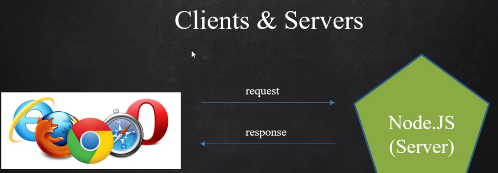

### learn nodejs

1. What is Node.JS ? ( V8 Engine )

- NodeJs is a platform , runtime environment
- NodeJs là một platform giúp dev viết code javascript ở phía server, ngày xưa chúng ta chỉ có thể viết JS
  ở phía client (browser)
- NodeJs has V8-Engine (google) => Convert JS to C++ to Assembly language (ngôn ngữ máy tính)
- Chat-app : SocketIO (Websocket)
- Web : ExpressJS, EJS
- Read more ... (later)

2. Environment ( IDE / NODE.JS )

- Install NodeJs, NVM
- Npm ( npm -v )

3. Clients / Servers | Request / Response

- Client == Browser : trình duyệt
- Server là máy chủ
- Request là những yêu cầu từ phía Client
- Response là những phản hồi của máy chủ trả về Client
  

LocalHost
Domain
Port

4. NPM ( Node package manager )

- javascript có Nvm - Trình quản lý gói (Cài cùng với NodeJS)
- Java có maven = porm => jar
- PHP có composer

5. ExpressJS App ( Hello world )

- npm install express framework
- Another framework instead ExpressJS https://expressjs.com/en/resources/frameworks.html

```js

const express = require('express')
const app = express()
const port = 3000

// routing config app.restfullAPI method
app.get('route', callback)


app.listen(port, () => {
    console.log(`Example app listening on port ${port}`)
})
```

6. View Engines (Template Engine)

- Giúp xử lý code javascript trong file HTML
- Hiếm khi sử dụng viewEngines, Vì BE sau này chủ yếu viết API, Sau này phía FE sẽ tự sử dụng FE
  Framework khác để xử lý
-

7. Statics Files
8. Routers & MVC
### 8.1  Basic Routing :

- Routing refers to determining how an application responds to a client request to a particular endpoint
- Routing is a URI (or path) and a specific HTTP request method (GET, POST, and so on).
- Routung là cách ứng dụng phản hồi cho client khi client yêu cầu từ một Endpoint cụ thể
- Để cấu hình routing cơ bản có thể sử dụng object app của Express và các HTTP method tương ứng (https://expressjs.com/en/4x/api.html#app.METHOD)
- 
```js
// Basic structure bellow: https://expressjs.com/en/guide/routing.html
app.METHOD(PATH, HANDLER)
// Respond with Hello World! on the homepage:
app.get('/', (req, res) => {
    res.send('Hello World!')
})

// Respond to POST request on the root route (/), the application’s home page:
app.post('/', (req, res) => {
    res.send('Got a POST request')
})

// Respond to a PUT request to the /user route:
app.put('/user', (req, res) => {
    res.send('Got a PUT request at /user')
})

// Respond to a DELETE request to the /user route:
app.delete('/user', (req, res) => {
    res.send('Got a DELETE request at /user')
})

// Use app.all() to handle all HTTP
app.all('/secret', function (req, res, next) {
    console.log('Accessing the secret section ...')
    next() // pass control to the next handler
})


```
### 8.2 Nested Routing :

9. HTTP Request Method / Database
10. Create Nav / EJS LOOP
11. Detail users / Routers Params
12. Form / POST Method
13. CRUD
14. REST API
15. Upload Files
    Part 1 : upload single filePart
    Part 2: upload multiple files
16. Middleware
17. What’s next ???
